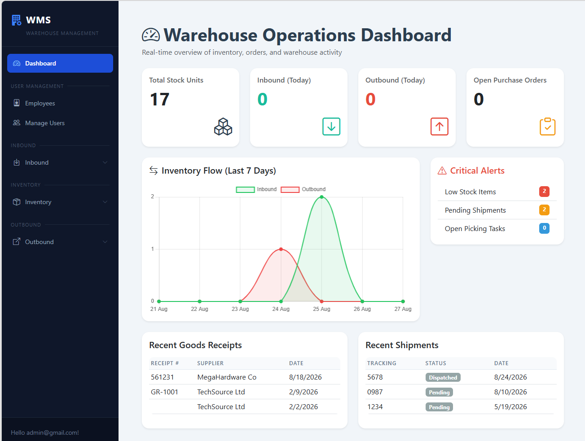

# Warehouse Management System (WMS)

A full-stack Warehouse Management System built with ASP.NET Core MVC, 
Entity Framework Core, and SQL Server. The system simulates real-world 
warehouse operations including inbound stock receiving, inventory tracking, 
outbound shipment processing, and returns management — going well beyond 
basic CRUD to implement realistic warehouse business workflows with a 
dedicated service layer.

---

## Screenshots



---

## Features

### Inventory Management
- Product, category, supplier, and location management
- Real-time stock level monitoring per location
- Low stock indicators

### Inbound Operations
- Purchase order creation and approval workflow
- Goods receipt processing against approved POs
- Automatic stock level updates via `InboundService`
- Full inventory transaction audit trail

### Outbound Operations
- Shipment creation and dispatch workflow
- Stock deduction on dispatch via `OutboundService`
- Inventory movement history

### Returns Management
- Return transaction logging
- Restock flow — returns good stock to inventory via `ReturnService`
- Write-off flow — logs unsellable returns without restocking

### Dashboard
- Real-time KPI cards (stock units, inbound/outbound today, open POs)
- Inventory flow chart (last 7 days, Chart.js)
- Critical alerts (low stock, pending shipments, open picking tasks)
- Recent goods receipts and shipments

### UI & Navigation
- Enterprise-style fixed sidebar with collapsible sections
- Bootstrap 5 responsive layout
- Bootstrap Icons throughout
- Role-based UI (Admin vs Client views)

### User Management
- ASP.NET Core Identity authentication
- Role-based authorisation (Admin, Client)
- User promotion/demotion via admin panel

---

## Tech Stack

| Layer | Technology |
|---|---|
| Backend | ASP.NET Core MVC, C# |
| ORM | Entity Framework Core |
| Database | SQL Server |
| Frontend | Razor Views, Bootstrap 5, Bootstrap Icons, Chart.js |
| Auth | ASP.NET Core Identity |
| Tools | Visual Studio, Git, GitHub, SSMS |

---

## Architecture

The project follows a layered architecture with business logic separated 
into dedicated service classes:

- **`InboundService`** — handles goods receipt posting, stock updates, 
  and PO status transitions
- **`OutboundService`** — handles shipment dispatch, stock deduction, 
  and transaction logging
- **`ReturnService`** — handles return restocking and write-offs

Controllers are kept thin — they delegate to services and handle 
user feedback via `TempData`.

---

## Database Design

The system uses a relational SQL Server database. Key entities:

`Products` · `Categories` · `Suppliers` · `Employees` · `Locations` · 
`StockLevels` · `PurchaseOrders` · `PurchaseOrderItems` · `GoodsReceipts` · 
`GoodsReceiptItems` · `Shipments` · `ShipmentItems` · `ReturnTransactions` · 

---

### Core Warehouse Flow
Supplier → Purchase Order (Approved)
→ Goods Receipt → InboundService
→ StockLevels++, InventoryTransaction logged

Customer Order → Shipment (Pending)
→ Dispatch → OutboundService
→ StockLevels--, InventoryTransaction logged

Return → ReturnService
→ Restock: StockLevels++, InventoryTransaction logged
→ Write-Off: InventoryTransaction logged, no stock change

---

## Getting Started

### Prerequisites
- .NET 9 SDK
- SQL Server (local or Docker)
- Visual Studio 2022+ or VS Code

### Setup

1. Clone the repository:
```bash
git clone https://github.com/esosajohnson/WarehouseManagementSystemWebApp.git
```

2. Update the connection string in `appsettings.json`:
```json
"ConnectionStrings": {
    "DefaultConnection": "Server=YOUR_SERVER;Database=WarehouseDB;
    Trusted_Connection=True;TrustServerCertificate=True"
}
```

3. Apply migrations:
```bash
dotnet ef database update
```

4. Run the application:
```bash
dotnet run
```

5. Default admin credentials are seeded on first run 
   (see `Program.cs` for details).

---

## Future Improvements
- Customer order management and picking task flow
- PDF/Excel reporting and export
- Barcode/QR scanning integration
- Multi-warehouse support
- Real-time notifications via SignalR
- Full audit logging (who changed what and when)
- Unit and integration tests
- Azure deployment

---

## What I Learned

- ASP.NET Core MVC architecture and request pipeline
- Entity Framework Core — relationships, migrations, and query optimisation
- Service layer pattern for separating business logic from controllers
- SQL Server database design and relational modelling
- Warehouse domain knowledge and business workflows
- Enum-driven status management with EF Core conversions
- Role-based authentication and authorisation with ASP.NET Core Identity
- Bootstrap 5 responsive UI design
- Debugging complex multi-layer application issues

---

## Author

**Esosa Johnson Ikponmwosa**  
BEng Computer Hardware & Software Engineering — First Class Honours  
[LinkedIn](https://www.linkedin.com/in/esosa-johnson) · 
[GitHub](https://github.com/esosajohnson)
